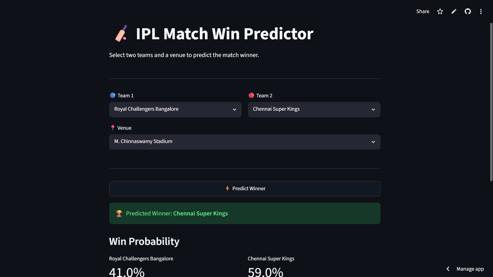
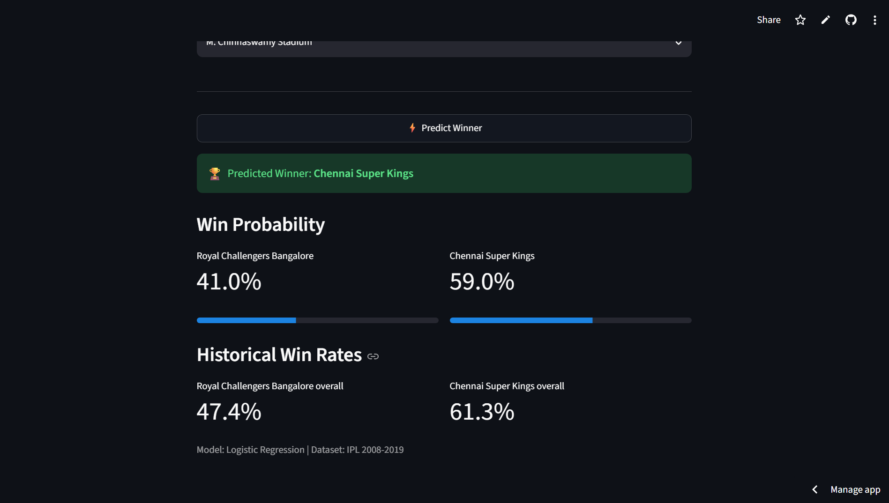

# 🏏 IPL Match Win Predictor


> A machine learning web app that predicts IPL match winners based on historical data from 2008–2019.

🔴 **[Live Demo](https://iplmatchpredictor-fjgyd2crf39uzcwrucxryr.streamlit.app/)**

---

## 📸 Screenshot




---

## 📌 Project Overview

This is an end-to-end data analytics and machine learning project built on the IPL (Indian Premier League) dataset. It covers the full pipeline — from raw data to a deployed web application.

**Given two teams and a venue, the app predicts:**
- Which team is likely to win
- Win probability for each team
- Historical win rates for both teams

---

## 🧠 How It Works

```
matches.csv
    │
    ▼
Data Cleaning → Remove ties, null winners
    │
    ▼
Feature Engineering
    ├── Team encoding (LabelEncoder)
    ├── Venue encoding (LabelEncoder)
    ├── Historical win rate per team
    ├── Win rate difference (most important feature!)
    └── Toss advantage
    │
    ▼
Model Training → Logistic Regression (class_weight='balanced')
    │
    ▼
Streamlit Web App → Deployed on Streamlit Cloud
```

---

## 📊 Key Findings from EDA

- **Mumbai Indians** have the most wins across all IPL seasons
- **Winning the toss has very little impact** on match outcome (only ~4% feature importance)
- **Venue** is the second most important factor (26% importance)
- **Historical win rate difference** is the strongest predictor (39% importance)
- Model accuracy: **57%** — realistic for cricket, which is inherently unpredictable

---

## 🗂️ Project Structure

```
ipl-match-predictor/
│
├── app.py                  # Streamlit web application
├── matches.csv             # IPL match data (2008–2019)
├── requirements.txt        # Python dependencies
└── README.md               # Project documentation
```

---

## ⚙️ Features

- **Team selector** — choose any two IPL teams
- **Venue selector** — 40+ IPL venues
- **Win probability bars** — visual percentage for each team
- **Historical win rates** — context behind the prediction
- **Instant prediction** — powered by a pre-trained ML model

---

## 🛠️ Tech Stack

| Tool | Purpose |
|---|---|
| Python | Core language |
| Pandas & NumPy | Data manipulation |
| Matplotlib & Seaborn | Exploratory data analysis |
| Scikit-learn | ML model (Logistic Regression) |
| Streamlit | Web app framework |
| Streamlit Cloud | Deployment |

---

## 🚀 Run Locally

**1. Clone the repository**
```bash
git clone https://github.com/YOUR-USERNAME/ipl-match-predictor.git
cd ipl-match-predictor
```

**2. Install dependencies**
```bash
pip install -r requirements.txt
```

**3. Run the app**
```bash
streamlit run app.py
```

**4. Open your browser at** `http://localhost:8501`

---

## 📈 Model Performance

| Metric | Score |
|---|---|
| Accuracy | 57% |
| Team2 Wins — F1 | 0.61 |
| Team1 Wins — F1 | 0.52 |
| Macro Avg F1 | 0.57 |

> Note: 57% accuracy is realistic for cricket prediction. Even professional models rarely exceed 65% due to the sport's inherent unpredictability.

---

## 📦 Dataset

- **Source:** [IPL Complete Dataset — Kaggle](https://www.kaggle.com/datasets/nowke9/ipldata)
- **Size:** 756 matches across 12 seasons (2008–2019)
- **Key columns:** `team1`, `team2`, `venue`, `toss_winner`, `toss_decision`, `winner`

---

## 🔮 Future Improvements

- [ ] Add head-to-head win history as a feature
- [ ] Include player performance stats from `deliveries.csv`
- [ ] Try XGBoost / Random Forest for better accuracy
- [ ] Add EDA dashboard page inside the app
- [ ] Save model with `pickle` to avoid retraining on every load
